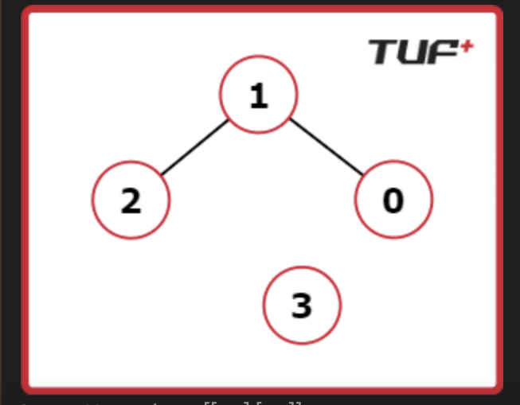

# 🔗 Connected Components in an Undirected Graph

## 📌 Problem Statement

Given an **undirected graph** consisting of:

- `V` vertices numbered from `0` to `V-1`
- `E` edges, where each edge is represented as `[ai, bi]`

Two vertices `u` and `v` belong to the **same component** if:
- There is a path from `u` to `v`, or
- There is a path from `v` to `u`

👉 Your task is to **find the number of connected components** in the graph.

---

## 🧠 What is a Connected Component?

A **connected component** is a subgraph where:
- Every pair of vertices is connected via some path
- No vertex is connected to any vertex outside the component

---

## 📥 Examples

### Example 1

V = 4

edges = [[0,1], [1,2]]

**Output:**

2

**Explanation:**
- Component 1 → `{0, 1, 2}`
- Component 2 → `{3}`

---

### Example 2

**Input:**

V = 7

edges = [[0,1], [1,2], [2,3], [4,5]]

**Output:**

V = 7
edges = [[0,1], [1,2], [2,3], [4,5]]

