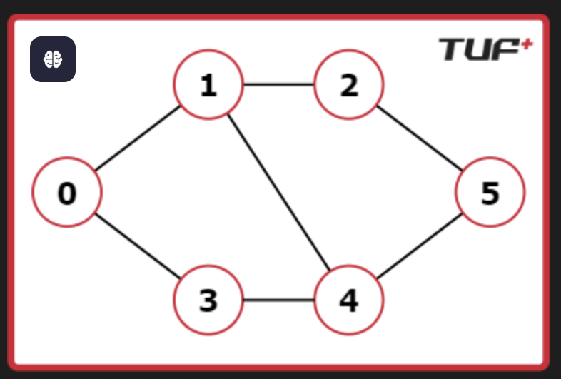
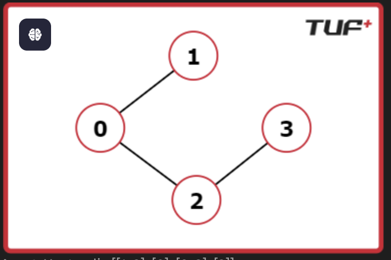

# 🔄 Detect Cycle in an Undirected Graph

## 📌 Problem Statement

Given an **undirected graph** with `V` vertices labeled from `0` to `V-1`, determine whether the graph contains a **cycle**.

The graph is represented using an **adjacency list**, where:

- `adj[i]` contains all the vertices connected to vertex `i`.

> ⚠️ Note: The graph does **not cont**

---

## 📊 Example 1

### Input

V = 6

adj = [[1, 3], [0, 2, 4], [1, 5], [0, 4], [1, 3, 5], [2, 4]]

### Output

### Explanation
Cycle exists:

0 → 1 → 2 → 5 → 4 → 1

---

## 📊 Example 2

### Input

V = 4

adj = [[1, 2], [0], [0, 3], [2]]

### Output

False

### Explanation

No cycle present.

---

## ⏱️ Complexity

| Type  | Complexity |
|------|----------|
| Time | O(V + E) |
| Space | O(V) |

---

## ⚠️ Important Points

- Always track **parent node** in undirected graphs
- Works for **disconnected graphs**
- Can be solved using **BFS or DFS**

---

## 🚀 Key Takeaway

> In an **undirected graph**, a cycle exists if you visit a node that is already visited and is **not the parent**.

---

## 🛠️ Tags

- Graph
- BFS
- DFS
- Cycle Detection
- Connected Components

